# 基础设施监控-主机使用说明
本文档将指导您如何使用基础设施监控查看主机相关信息，包括主机列表、主机详情、主机进程、主机指标、主机进程树、主机CGROUP图表、CPU拓扑图等。

### 点击左侧导航栏“主机”
1. 查询主机
搜索范围：可以按条件对主机进行筛选。
值：选择搜索范围对应的具体的查询条件。
2. 支持分页显示，每页显示10条记录。
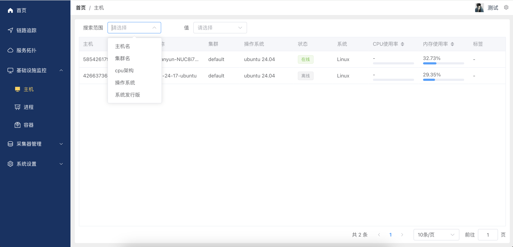
3. 主机列表展示信息
- 主机 ID：唯一标识主机的号码。
- 名称：主机名称。
- 集群：主机所属的集群信息。
- 操作系统：主机运行的操作系统版本。
- 状态：主机的在线状态，如“在线”或“离线”。
- 系统：主机架构信息，如“Linux”。
- CPU 使用率：显示主机的 CPU 使用情况。
- 内存使用率：显示主机的当前内存使用情况。
- 标签：对主机添加自定义标签。
- IP地址：主机的 IP 地址。
- IPV6地址：主机的 IPV6 地址。
- 创建时间：主机的创建时间。
- 更新时间：主机的更新时间。

### 主机详情
点击主机列表中的某一项，可以查看主机详情。
可切换选项卡查看不同信息。
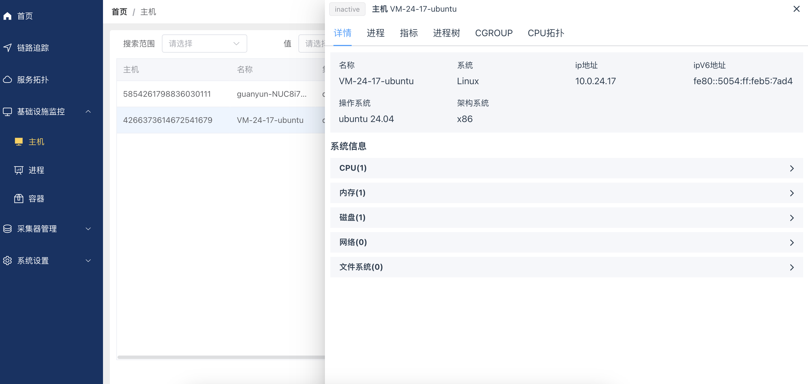

1. 主机信息概览
名称：主机名，如 “VM-24-17-ubuntu”
系统：如：Linux
操作系统：如：Ubuntu 24.04
架构系统：如：x86
IP 地址：IPv4 和 IPv6 地址

2. 系统信息，可点击右侧箭头展开查看详细信息。
- CPU：查看CPU使用情况。
- 内存：监控内存状态。
- 磁盘：了解磁盘利用率。
- 网络：展示网络连接信息。
- 文件系统：显示文件系统配置。

3. CPU信息
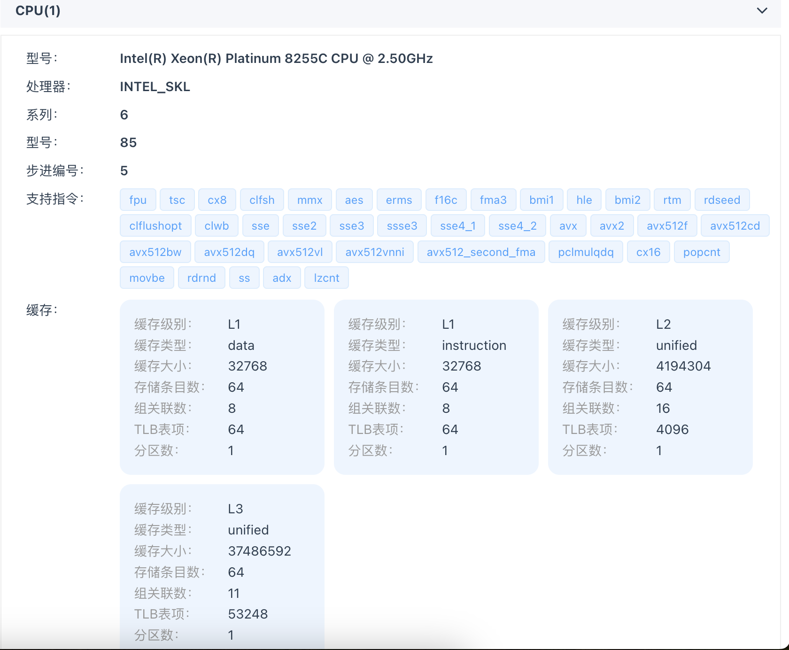
- cpu基本信息
型号：CPU 型号
处理器：CPU处理器类型
系列：CPU 系列
型号：CPU 型号
步进编号：CPU 步进编号
- 支持指令集
CPU支持的指令集如下：
>fpu, tsc, cx8, clfsh, mmx, aes, erms, f16c, fma3, bmi1, hle, bmi2, rtm, rdseed
clflushopt, clwb, sse, sse2, sse3, ssse3, sse4_1, sse4_2, avx, avx2, avx512f, avx512cd
avx512bw, avx512dq, avx512vl, avx512vnni, avx512_second_fma, pclmulqdq, cx16, popcnt
movbe, rdrnd, ss, adx, lzcnt
- 缓存信息
缓存级别：CPU缓存级别
缓存类型：CPU缓存类型
缓存大小：CPU缓存大小
缓存个数：CPU缓存个数
缓存等级：CPU缓存等级
缓存共享：CPU缓存是否支持多核共享
分区数量：CPU缓存分区数量

4. 内存信息

展示内存信息如下：
总内存(M)
已用内存(M)
可用内存(M)
交换内存(M)

5. 磁盘信息
展示cipit磁盘信息，包括：
- 磁盘名称
- 节点数量
- 已使用容量(G)

### 主机进程
点击主机详情页的“进程”选项卡，可以查看主机进程信息。
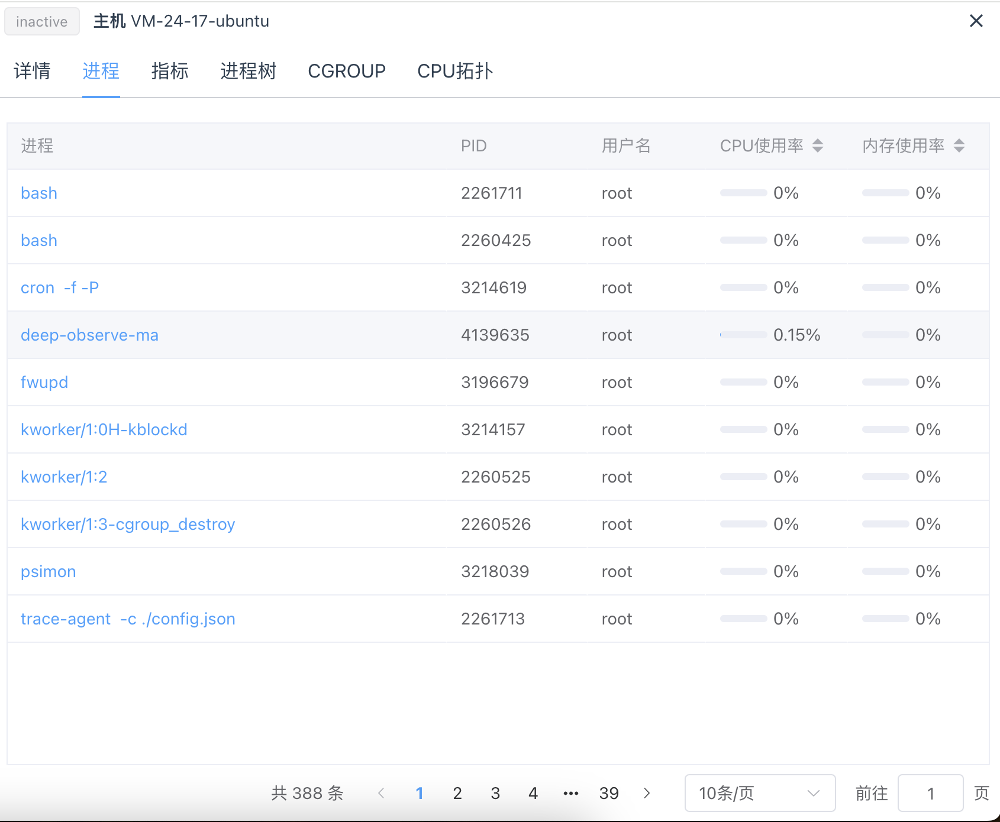
1. 进程列表
展示主机进程列表，包括：
- 进程ID
- 进程名称
- 进程状态
- 进程CPU使用率
- 进程内存使用率

2. 支持分页，默认10条记录/页。
3. 点击进程名，可以查看进程详情。
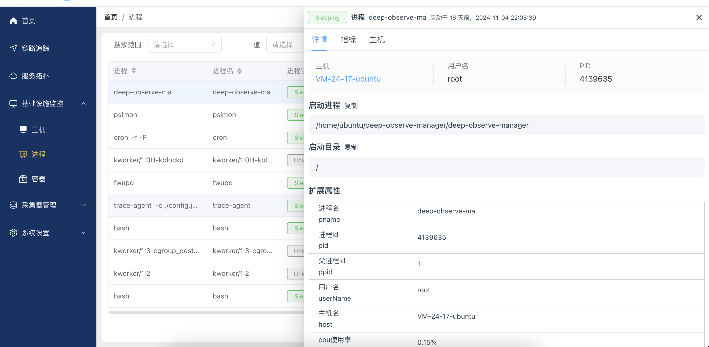

### 主机指标
1. 在“指标”选项卡中，用户可以查看以下系统性能指标：

- CPU 使用率：监控 CPU 在一段时间内的使用率。
- 内存使用率：查看内存的使用情况。
- 内存可使用率：显示可用内存的比例。
- 磁盘使用量：监测磁盘空间的使用。
- 磁盘读取繁忙度：读取操作对磁盘负载的影响。
- 磁盘写入繁忙度：写入操作对磁盘负载的影响。
- 网络流入量：网络数据的接收量。
- 网络流出量：网络数据的发送量。
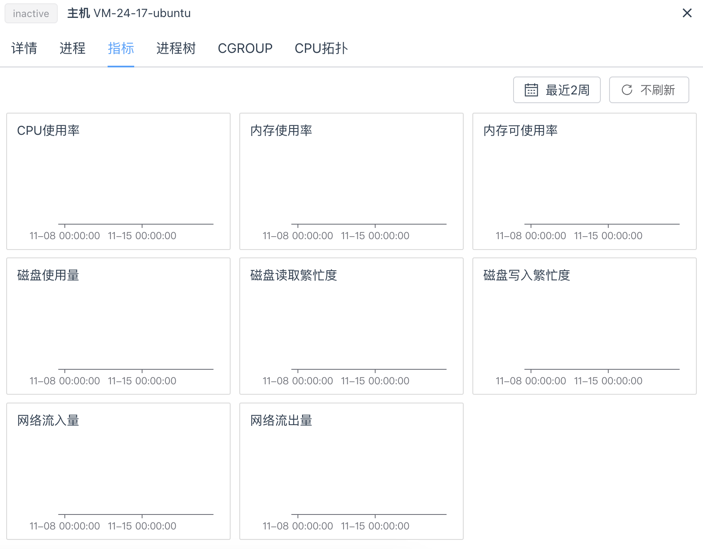

2. 选择时间范围
点击右上角的时间选择框，可选取如“最近2周”的数据来查看。
支持选择一段时间范围，如最近一小时、最近一天、最近一周等。
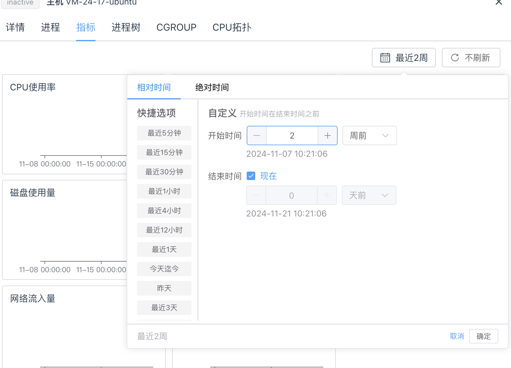
3. 实时刷新
可选择实时刷新，实时获取最新数据。

### 主机进程树
1. 点击主机详情页的“进程树”选项卡，可以查看主机进程树。
>进程树功能通过图形化的层次结构展示主机上所有当前运行的进程。用户可以清晰地了解进程之间的父子关系。

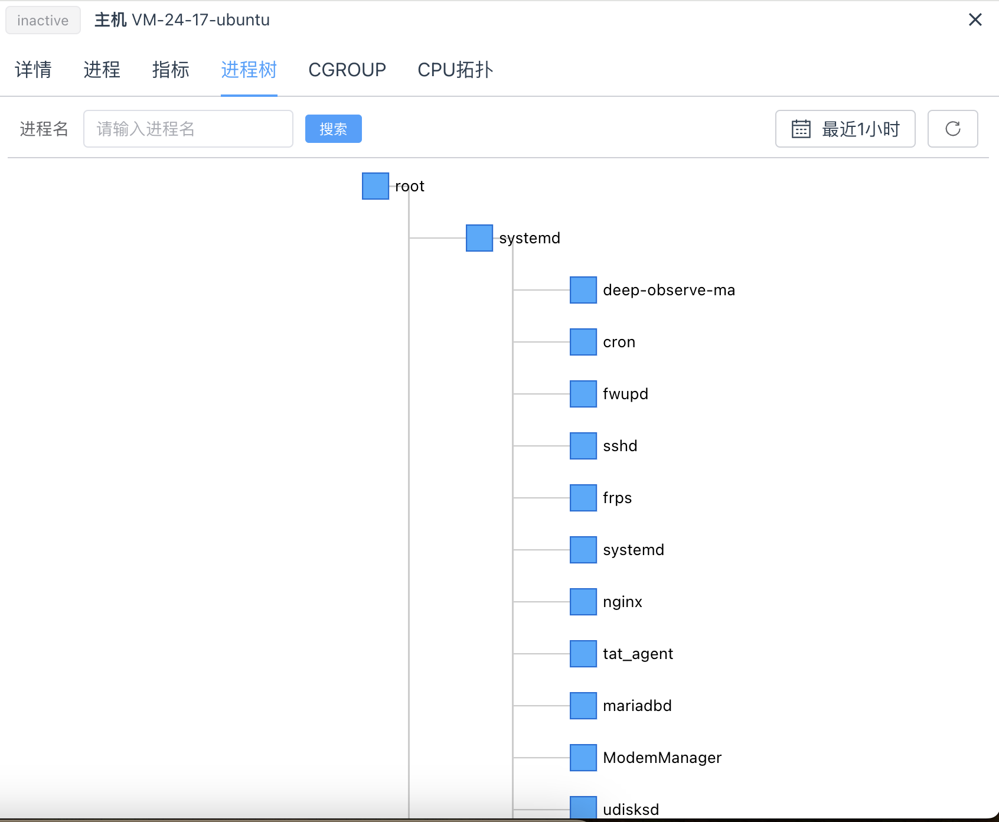

2. 查看进程关系
界面上将显示一个树状图，根节点通常是“root”，下一级为系统级进程如“systemd”。
每个矩形块代表一个进程，显示其名称。

3. 搜索进程
在搜索框中输入进程名称，点击“搜索”按钮可快速定位特定进程。
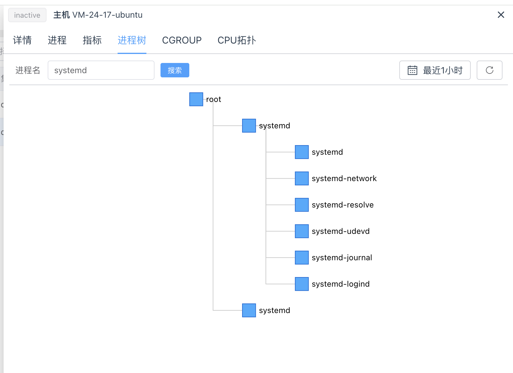

4. 调整视图
用户可以通过选择时间范围（如“最近1小时”）来调节显示的进程活动。

5. 刷新数据
点击右上角的刷新按钮以更新进程树视图。

6. 进程详情
点击进程，可跳转到进程详情。

### 主机CGROUP图表
1. 点击主机详情页的“CGROUP”选项卡，可以查看主机CGROUP图表。

2. 查看节点信息（hover查看详细信息）
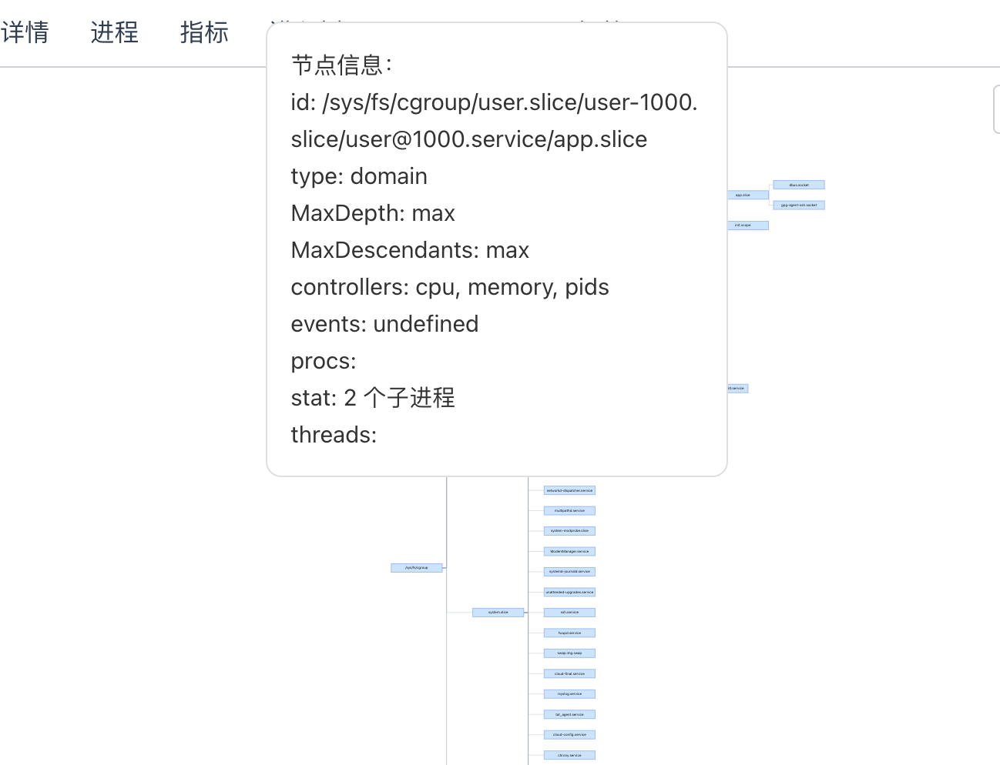

3. 调整视图
用户可以通过选择时间范围（如“最近1小时”）来调节显示的CGROUP图表。

4. 刷新数据
点击右上角的刷新按钮以更新CGROUP视图。

### CPU拓扑图
1. 点击主机详情页的“CPU拓扑图”选项卡，可以查看CPU拓扑图。
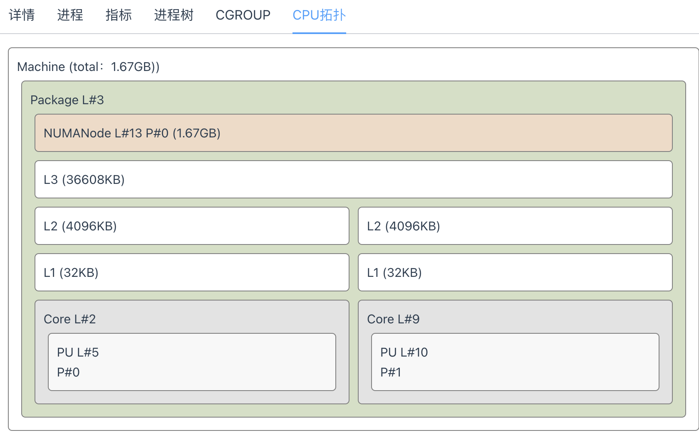

2. 拓扑图结构

- 机器总览
Machine (total: 1.67GB)：指示整个机器上的总内存容量。
- 包（Package）信息
Package L#3：表示 CPU 的一个物理包，包括多个核心和缓存。
NUMANode L#13 P#0 (1.67GB)：表示该包包含一个 NUMA 节点，拥有 1.67GB 的内存。
- 缓存层级
L3 缓存 (36608KB)：三级缓存，通常用于多个核心共享的大容量缓存。
L2 缓存 (4096KB)：二级缓存，核心之间共享或独立存在，较高速的缓存。
L1 缓存 (32KB)：一级缓存，速度最快，位于每个核心内部。
- 核心（Core）信息
Core L#2（核心 2）：
PU L#5：表示物理处理器单元（Processing Unit）。
P#0：处理器编号。
Core L#9（核心 9）：
PU L#10：表示物理处理器单元（Processing Unit）。
P#1：处理器编号。